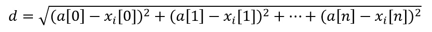

# introduce
机器学习主要分为两大类，有监督学习(supervised learning)和无监督学习(unsupervised learning)。有监督学习又可分两类：分类（classification.）和回归（regression），分类的任务就是把一个样本划为某个已知类别，每个样本的类别信息在训练时需要给定，比如人脸识别、行为识别、目标检测等都属于分类。回归的任务则是预测一个数值，比如给定房屋市场的数据（面积，位置等样本信息）来预测房价走势。而无监督学习也可以成两类：聚类（clustering）和密度估计（density estimation）,聚类则是把一堆数据聚成弱干组，没有类别信息；密度估计则是估计一堆数据的统计参数信息来描述数据,比如深度学习的RBM。
# summary
1. k-近邻算法是局域实例的学习，使用算法时我们必须有接近实际数据的训练样本数据
2. k-近邻算法必须保存全部数据集
3. 如果训练数据集很大，必须使用大量存储空间
4. 由于必须对数据集中的每个数据计算距离值，实际使用可能非常耗时
5. 无法给出任何数据的基础结构信息，因此我们无法知晓平均实例样本和典型实例样本具有什么特征，概率测量可以解决这个问题

- 优点：精度高，对异常数据不敏感，无数据输入假定 
- 缺点： 时间和空间复杂度均较高 
    - 适用的数据类型：数值型和标识型

基本K均值算法的基本思路为：首先你需要有一组训练样本，也称作训练样本集。该集合中每个样本的分类类别都是已知的，也就是我们知道每个数据与所属分类的对应关系。此时，可以输入一个待预测的数据，将新数据的每个特征与训练样本集中每个数据的特征进行比较，根据一种比较结果（如欧氏距离），找出k 个与待预测数据最相似的训练样本，看看这些训练样本都是属于哪一类的，最后就是秉承“多数占优”的原则：既然待预测数据与很多个某A类的训练样本都很近，和其他类不是很相近，那就把预测数据判定为A类吧。

在以上描述中提出使用欧氏距离作为待预测数据和训练样本集的比较结果，即假设测试样本为a，而xi表示训练样本集中的第i个样本，测试样本和训练样本均有n个特征属性，则测试样本和训练样本之间的欧氏距离定义为：



通常该算法的k是不大于20的正整数。当k=7 时，根据上述欧氏距离公式计算出78个与待预测数据最近的训练样本，在这7个实例中，某个分类出现的次数最多，则预测数据就被分到该类。