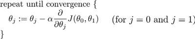

Logistic回归的目的是寻找一个非线性函数Sigmoid的最佳拟合参数，求解过程可以由最优化算法来完成。

longfloat() 
可以解决RuntimeWarning: overflow encountered in exp
  return 1.0 / (1 + exp(-inX))
  
  
生活中，人们经常会遇到各种最优化问题，比如如何在最短时间从一个地点到另外一个地点？如何在投入最少的资金而却能得到最高的受益？如何设计一款芯片使其功耗最低而性能最好？这一节就要学习一种最优化算法——Logistic回归，设计最优化算法的目的依然是用于分类。在这里，**Logistic回归的主要思想是根据现有的数据对分类边界线建立回归公式，达到分类的目的。

数学认为，回归是一个拟合过程，回归分析本质上就是一个函数估计的问题，就是找出因变量和自变量之间的因果关系。具体到例子，假设我们有一些数据点，现在使用一条直线对这些点进行拟合，使得这条线尽可能地表示数据点的分布，这个拟合过程就称作“回归”。
  
- 优点：计算代价不高，易于理解和实现
- 缺点：容易欠拟合，分类精度可能不高
- 适用的数据类型：数值型和标称型数据
  
一、基于Sigmoid函数的Logistic回归

- Sigmoid函数
- 基于最优化方法的最佳回归系数确定
- 梯度上升法的实现 

```python
    除了部分指标主观和难于预测外，该数据还存在一个问题，数据集中有30%的值是缺失的.
    # proble: 如果机器上某个传感器损坏了一个特征，怎么办
    # resolve:
        1. 使用可用特征的均值来填补缺失值
        2. 使用特殊值来填补缺失值, 如-1
        3. 忽略有缺失值的样本
        4. 使用相似样本的句子添补缺失值
        5. 使用另外的机器学习算法预测缺失值

    我们采用0替代缺失值，因为我们需要一个在更新时不会影响系数的值
    weights = weights + alpha * error * dataMatrix[randIndex] = weights
    sigmooid(0) = 0.5

    预处理2, 有一条数据中类别标签已经缺失，那么丢弃，　如果采用knn就不太可行
    
    随机梯度上升算法与梯度上升算法的效果相当，但占用更少的资源．
    随机梯度上升是一个在线算法，他可以在新的数据到来时就完参数更新，而不需要重新读取整个数据集来进行批处理运算
    
```  




```python
梯度下降背后的思想是:开始时我们随机选择一个参数的组合(θ 0 , θ 1 , . . . . . . , θ n ),计算代
价函数,然后我们寻找下一个能让代价函数值下降最多的参数组合。我们持续这么做直到到
到一个局部最小值(local minimum),因为我们并没有尝试完所有的参数组合,所以不能确
定我们得到的局部最小值是否便是全局最小值(global minimum),选择不同的初始参数组
合,可能会找到不同的局部最小值。
```


批量梯度下降(batch gradient descent)


其中a是学习率(learning rate),它决定了我们沿着能让代价函数下降程度最大的方向
向下迈出的步子有多大,在批量梯度下降中,我们每一次都同时让所有的参数减去学习速率
乘以代价函数的导数。

# summary
Logistic回归: 根据现有数据对分类边界线建立回归公式

    分类的结果由多个参数决定，每个参数对结果的影响不同，先给定一个参数集，
    假设每个系数对数据集的影响都是线性的，可以得到 z = w0x0 + w1x1 + w2x2 + ... + wnxn,
    通过sigmoid函数进行分类，大于0.5的被划分为1,小于0.5被划分到0,
    通过不断地对每个参数进行　weights = weights + step * xi * error进行调整,
    找出时最佳weigths使代入sigmoid得到的分类最接近于0
    基于最优化方法的最佳回归系数决定

梯度上升发: 要找到某个函数的最大值,最好的方法是沿着该函数的梯度方向搜寻,

Sigmoid 大于0.5被划分到１,小于0.5被划分到0, 使用Sigmoid是因为分类只有0和1吗

为什么要采用阶跃函数simoid
为什么要label[i] - h    为了拟合
20
为什么可以alpha 可以这么大

梯度下降和梯度上升的区别: 我用梯度下降处理有28个特征300个训练样本的话比较好

我们得到的不是global minimum　而是local minimum, 是因为数据集理论上不能无限大吗，即使便利数据集，因为有数据集无法覆盖的点

选择不同的初始参数组合,可能会找到不同的局部最小值。

不用梯度下降怎么求最收敛值

在每一个方向上求偏导数，但sigmoid并没有跟偏导相关********
f(w) = w0x0 + w1x1 + w2x2 + ... + wnxn
w := w + a▽w(fw)

以点盖面，取前点的前两个绘制，以观察所有点有没有被分开, 是不可行的多维度用少维度刻画不具备观测价值


```python
"""
/home/yue/Github/machine_learning/05_logistic_regression/logRegres.py:35: RuntimeWarning: overflow encountered in exp (遇到溢出)
  return 1.0 / (1 + exp(-inX)) 
换成float就好了

In your case, it means that b is very small somewhere in your array, and you're getting a number (a/b or exp(log(a) - log(b))) that is too large for whatever dtype (float32, float64, etc) the array you're using to store the output is.

Numpy can be configured to

Ignore these sorts of errors,
Print the error, but not raise a warning to stop the execution (the default)
Log the error,
Raise a warning
Raise an error
Call a user-defined function
See numpy.seterr to control how it handles having under/overflows, etc in floating point arrays.

"""
```





# 过度拟合(over fit):
  当数据特征过多，当数据样本太小

# 模型选择算法(自动选择和减少特征向量)
  减少过拟合的发生，舍弃一部分数据，同时舍弃了问题中的一些信息
  1. Reduce number of features
    Manually select which features to keep
    Model selection algorithm(later in course)
  2. Regularization
    - keep all features, but reduce magnitude/values of parameters (sita)j
    - works well when we have a lot of features, each of which contributes a bit to predicting y.
  
  
